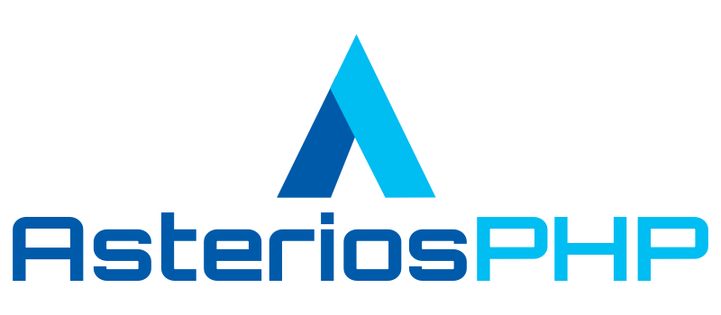

  

    <a href="https://asteriosphp.de">AsteriosPHP Project Site</a>
     

🙋‍♀️ A short introduction

The AsteriosPHP Framework is a simple and flexible PHP 8.+ framework,
inspired from the best features of other frameworks, in a modern and elegant way.

🌈 Core - Team

Our team is at the moment a small but nice and open-minded team.

Feel free to join us. If you do so, please write a e-mail to info@asteriosphp.de.

## Benjamin Butschko Founder / Core-Developer

Benjamin - Ben - start programming with PHP in 1999. He started his professional development career as web-developer for a big trading-house with international direction.

Beside this development career, he administrate IBM midrange computer (AS/400) and linux / unix based server systems. After this he moved to the baltic sea to work as computer engineer and web-developer.

In 2003 he found in Kiel a small linux/unix user group to help people to work under linux. However, programming is his main capability until now. Currently he is lead software engineer with focus on webbased applications based on PHP

## Core-Developer
### 🧙 Jörg Heinrich
Jörg start 1988 with CNC programming. His professional development career as backend developer started at 1993 with Ansi-C and Oracle database.

Since 2003 he programming in PHP as web-backend-developer. Since 2022 with a focus on the Laravel framework.

### 👩‍💻 Andreas Roos

## Links
[Asterios Project Site](https://asteriosphp.de)